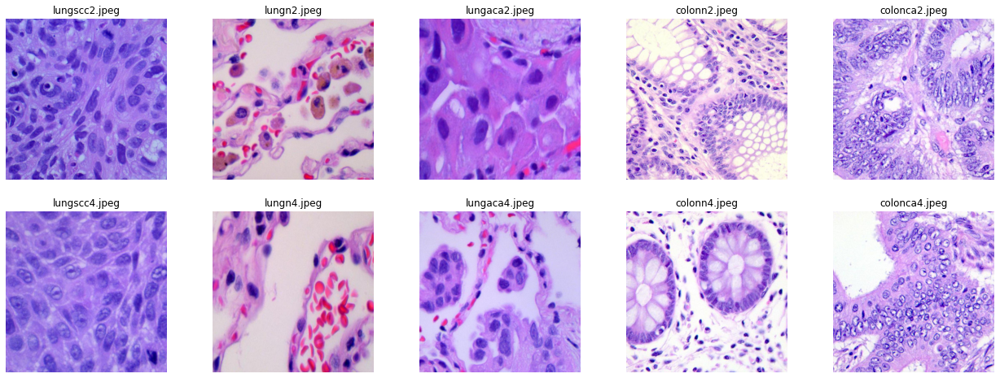
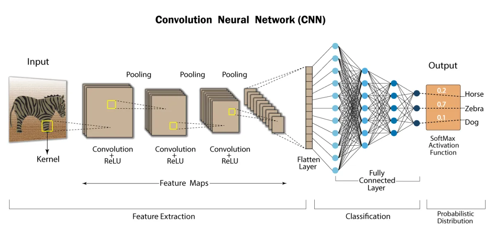

# 🫁 Lung-and-Colon-Cancer-Image-Classification

Lung and colon cancers are two of the most common malignancies, which in some cases, may develop synchronously.

Colon cancer is a type of cancer that begins in the large intestine (colon). The colon is the final part of the digestive tract. Colon cancer is sometimes called colorectal cancer, which is a term that combines colon cancer and rectal cancer, which begins in the rectum.
Lung cancer, also known as lung carcinoma, since about 98–99% of all lung cancers are carcinomas, is a malignant lung tumor characterized by uncontrolled cell growth in tissues of the lung.

## 🪄 About
Our objective is to build a model to classify or differentiate type of Cancer(Lung or Colon) among 5 classes based on the dataset of images using Convolutional Neural Networks.

## 📈 Dataset
This dataset contains 25,000 histopathological images with 5 classes.

All images are 768 x 768 pixels in size and are in jpeg file format. The images were generated from an original sample of HIPAA compliant and validated sources, consisting of

1. 750 total images of lung tissue (250 benign lung tissue, 250 lung adenocarcinomas, and 250 lung squamous cell carcinomas) and
2. 500 total images of colon tissue (250 benign colon tissue and 250 colon adenocarcinomas) and augmented to 25,000 using the Augmentor package.

## 🧠 Convolutional Neural Network(CNN)

